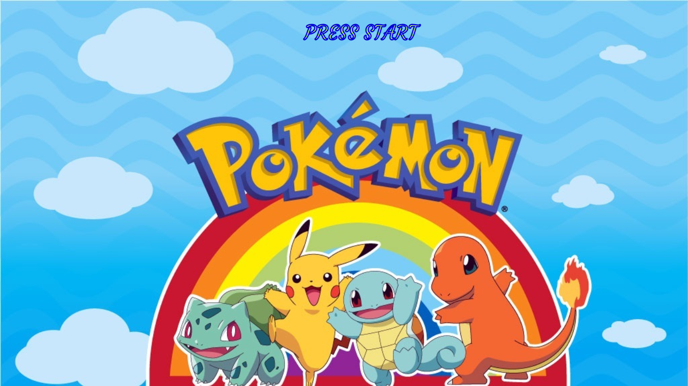
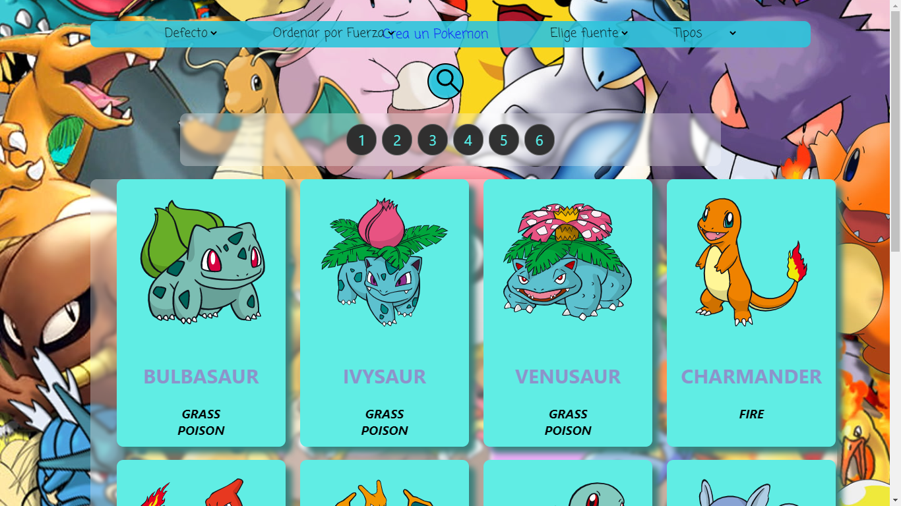
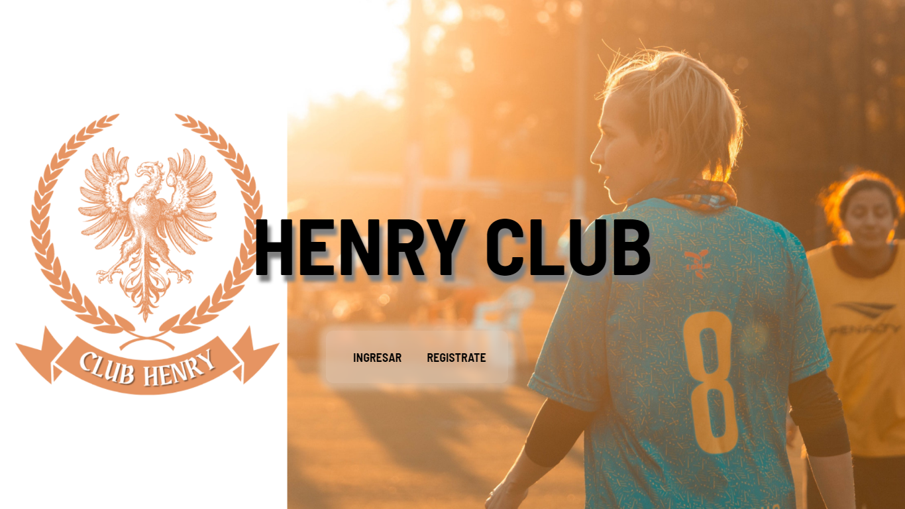
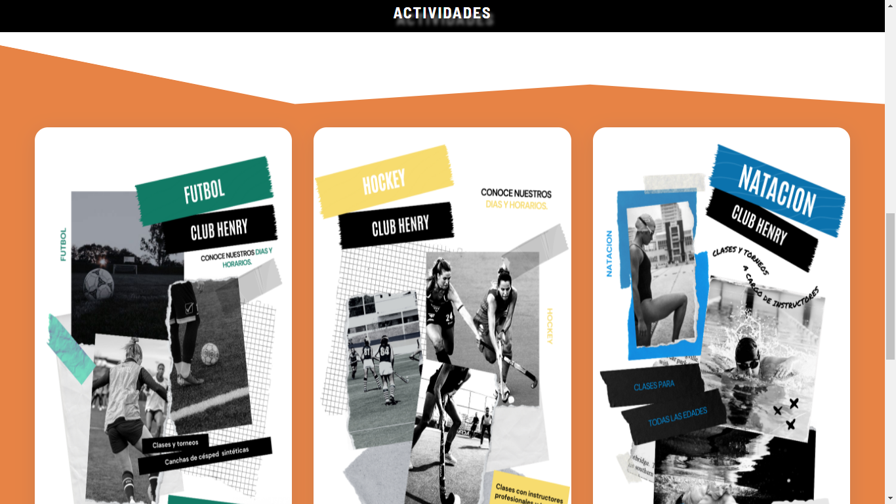

### <h1>Bienvenido, Soy Marco Juarez 👋</h1> 
 
 
 
 <i align="left">Soy Desarrolador Full-Stack, con orientacion al Back-end⚛️.
  
 Me he egresado en el Bootcamp de @SoyHenry, donde pude mejorar y adquirir mas conocimiento
  
 Por el momento sigo mejorando y aprendiendo nuevas tecnologias y creando nuevos proyecto con el fin de mejorar como desarrollador. 
 
 En el año 2021 descubri la programacion y el desarrollo web y me encanto, desde ese momento comenzo mi camino 
 en este maravilloso mundo en el cual quiero destacarme, por este motivo siempre estoy aprendiendo constantemente nuevas tecnologias y/o frameworks. Disfruto trabajar en equipo, porque siempre se puede ver
 diferentes puntos de vistas ante un mismo problema y siempre aprendemos o enseñamos algo a los demas.
 </i>

<h2 align="center">Tecnologias:</h2>

<h3>FrontEnd</h3>
<h4> JAVASCRIPT</h4>
<h4> CSS</h4>
<h4> HTML</h4>
<h4> REACT </h4>
<h4> REDUX </h4>
 
<h3> BackEnd & Database</h3>
<h4> NODEJS </h4>
<h4> POSTGRES</h4>
<h4> SEQUELIZE</h4>
 

<h3>Herramientas</h3>
<h4>GIT</h4>
<h4>POSTMAN</h4>
<h4>REACT DEVTOOLS</h4>
<h4>REDUX DEVTOOLS</h4>
  

 

 <h3>MIS PROYECTOS</h3>
 

<h3 align="center">POKEMON</h3>

 <h4>En el inicio del proyecto se pueden ver todos los pokemons ordenados en cartas personalizadas. Cada carta va a tener acceso al detalle de cada pokemon, ya sean los pokemons originales o los creados por nosotros.
La api cuenta con un paginado, para poder ver a todos los pokemons de manera ordenada.
 
Se puede:
- Buscar al pokemon por su nombre atraves del buscador.
- Ordenar ascendentemente y descendentemente por orden alfabético.
- Ordenar ascendentemente y descendentemente por fuerza.
- Filtrar por tipo de pokemon.
- Filtrar por pokemons originales o los creados por el usuario.
- Tenemos la posibilidad de crear pokemons con los datos de nuestra preferencia. El formulario cuenta con sus respectivas validaciones.

 
 <a href="https://pokemon-pied.vercel.app/home">Enlace del Proyecto</a>

</h4
 
 

<h3 align="center">CLUB HENRY</h3>

<h4>En este proyecto se muestra la pagina de un club polideportivo, en el cual podemos ser tanto administrador, entrenador o deportista, de esta manera todos pueden obtener infromacion de sus necesidades en un solo lugar.
 
Se puede:
- Buscar una noticia por su nombre atraves del buscador.
- Se puede adquirir un plan de deporte.
- Añadir un carrousel de imagenes.
- Añadir noticias.
- Filtrar deportes por categorias.
- Crear, modificar y eliminar usuarios.
- Administrar la informacion (imagenes, banear usuarios, comentarios, etc).
 
 <a href="https://club-henry.vercel.app/">Enlace del Proyecto</a>

</h4
 
 

 
 
<h3>Contactame</h3>
 
 <ul>
    <li>LinkedIn: <a href='https://www.linkedin.com/in/marcojuarez/'>Click Aqui</a></li>
    <li>Email: <a href='#'>marckk63prog@gmail.com</a> <li>
 </ul>
 
 
<!--
**Marck1js/Marck1js** is a ✨ _special_ ✨ repository because its `README.md` (this file) appears on your GitHub profile.

Here are some ideas to get you started:

- 🔭 I’m currently working on ...
- 🌱 I’m currently learning ...
- 👯 I’m looking to collaborate on ...
- 🤔 I’m looking for help with ...
- 💬 Ask me about ...
- 📫 How to reach me: ...
- 😄 Pronouns: ...
- ⚡ Fun fact: ...
-->
